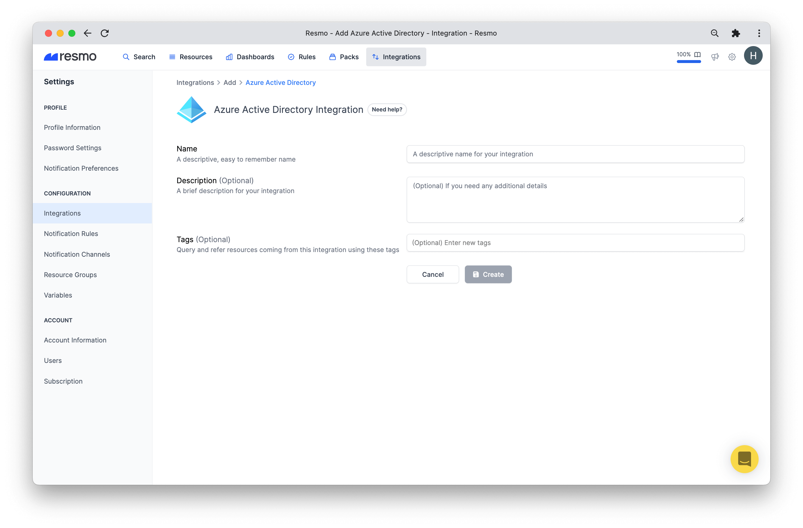
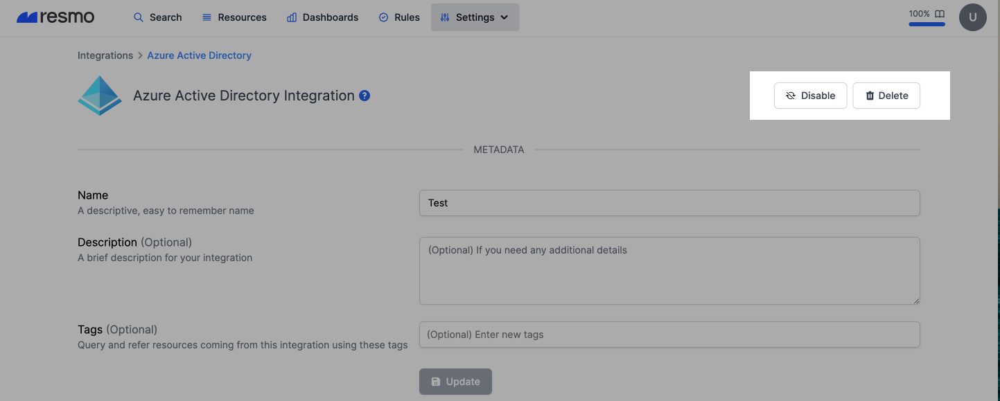

# Azure Active Directory Integration

## Resmo + Azure Active Directory Integration Fundamentals

Resmo easily integrates with AzureAD to secure and query your entire resource asset.

### What does Resmo offer to AzureAD users?

* Collect and monitor all AzureAD resources in near real-time from one place
* Query your assets with the simplified SQL language
* Run automated rule checks with managed or custom rules
* Get notified of rule changes in real-time
* Discover historic data for your resource changes, queries, and rule violations

### How does the integration work?

Resmo connects with AzureAD through an OAuth flow. Then, it initiates polling and aggregating your existing resources. After the initial polling, Resmo performs polling at regular intervals to collect resource changes in real-time.

| Available Resources  |
| -------------------- |
| AD Organization      |
| AD Service Principle |
| AD User              |
| AD User Group        |

### Common queries and rules

* View AzureAD organization verified domains.
* List guest users.
* See Service Principal OAuth2 permissions.
* Find user groups that are not assignable to any role.
* List user accounts that are not enabled.

### Integration walkthrough

#### How to Install

1. Sign up or sign in to Resmo.
2. Navigate to Integrations and select Azure Active Directory.
3. Enter a descriptive name for your integration.

4\. You'll be redirected to Azure. Accept permissions.

5\. Your integration is ready! Now you can start querying your Azure Active Directory resources!

#### How to Uninstall

1. Log in to your Resmo account.
2. Go to Settings>Integrations from the navigation bar.
3. Select the Azure Active Directory integration you wish to uninstall.

4\. To temporarily pause the integration, click the Disable button from the top right. Or, you can permanently remove it by clicking the Delete button.

5\. Optionally, you can remove your oAuth token after uninstalling the integration permanently. Follow instructions [here](https://docs.microsoft.com/en-us/azure/active-directory/enterprise-users/users-revoke-access#azure-active-directory-environment).

### Support

If you have any questions about the Azure Active Directory integration or Resmo in general, feel free to email us at contact@resmo.com or contact us via live chat on our website.
