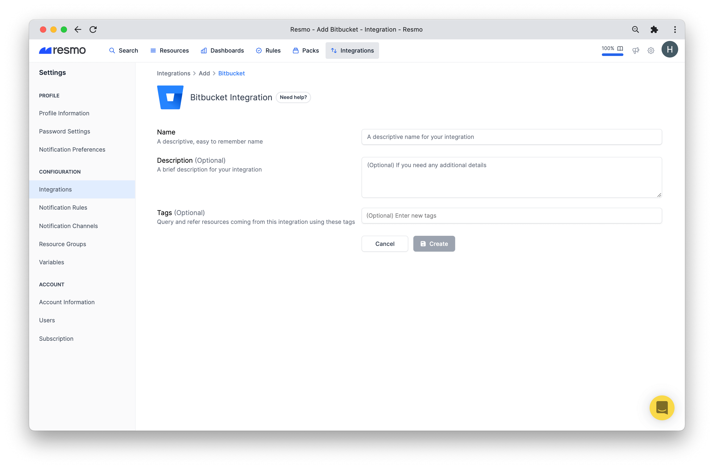
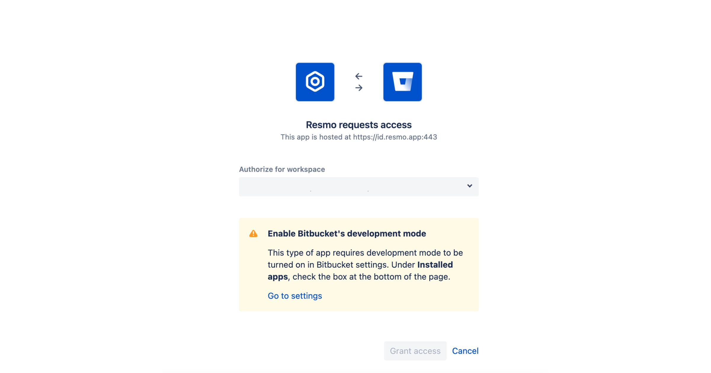

# Bitbucket Integration

## Resmo + Bitbucket Integration Fundamentals

Resmo seamlessly integrates with Bitbucket to secure your resources and mitigate asset vulnerabilities.&#x20;

### What does Resmo offer to Bitbucket users?

* Consolidate all Bitbucket assets in one place and track resource changes
* Automate security and compliance checks with rules
* Get alerted when there is a rule violation
* Query your entire Bitbucket asset inventory using SQL
* Visualize your cyber assets with dashboards and accelerate security controls

### How does the integration work?

Resmo has a Bitbucket application that you can install once you sign up for a Resmo account. Our application uses API to make the initial polling and receive existing resources. Then, we receive resource changes and updates in real-time by regular polling.

[Available Resources](https://docs.resmo.com/resources/bitbucket)

### Common queries and rules

* Identify publicly accessible projects
* Detect active repository webhooks
* List repositories that deny forking
* See public Bitbucket workspaces
* Identify pull requests that don't close the source branch
* List repositories that override the branching model

### Integration Walkthrough

#### How to Install

1. Login to your Resmo account and go to the Integrations page.
2. Click the Add Integration button and select Bitbucket from the integrations list.
3. Type a descriptive name for the integration and optionally a description.

4\. You'll be redirected to Bitbucket; accept permissions.

5\. Your Bitbucket integration is ready! Now you can start querying your resources!

#### How to Uninstall

1. Navigate to Settings>Integrations and open the detail page of the integration you wish to uninstall.&#x20;
2. You have two options. To temporarily pause the integration, click the Disable button. Or you can permanently remove the integration using the Delete button.

### Troubleshooting

If you have any questions or troubles with the integration, feel free to contact us via live chat on our website or email us at contact@resmo.com.
