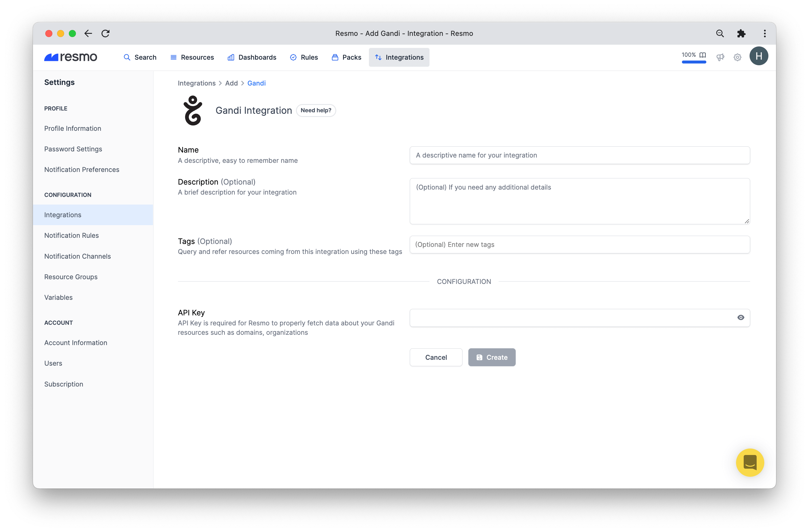
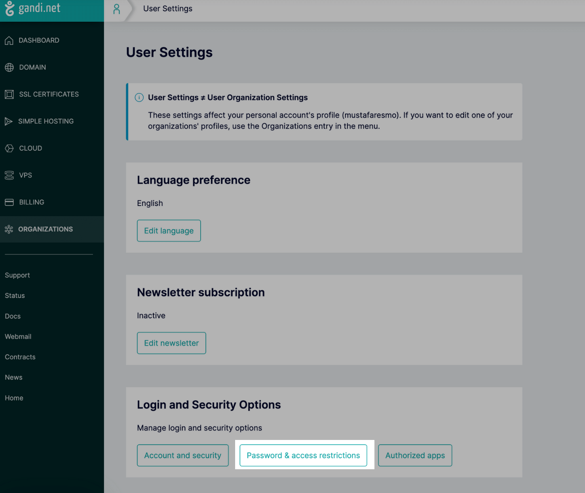
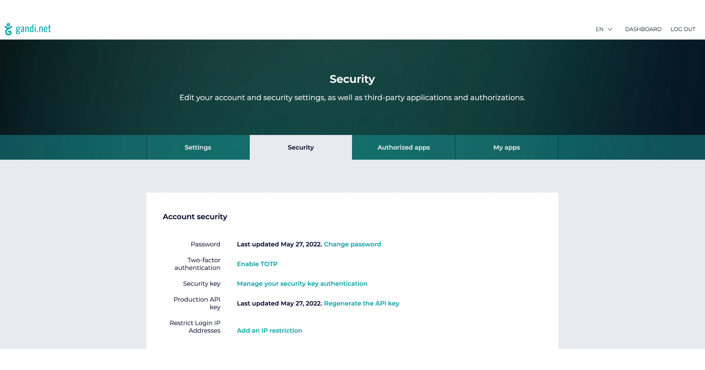

# Gandi Integration

## Resmo + Gandi Integration Fundamentals

Resmo integrates with Gandi to enhance the security and compliance of your Gandi environment.

### What does Resmo offer to Gandi users?

* Consolidate and monitor all your Gandi resources in one place.
* Query your Gandi organizations, domains, certificates, and more.
* Set up rules to continuously assess your Gandi resources.
* Set up notification rules to get alerted on rule violations.

### How does the integration work?

Once you sign up to Resmo, you can easily integrate your account with Gandi using an API key. Resmo uses API to do the initial polling and collect existing resources. Then, we receive resource changes and updates in real-time by regular polling.

[Available Resources](https://docs.resmo.com/resources/gandi)

### Common queries and rules

* List DNSSEC enabled domains
* Detect live DNS supported domains
* List domain registries that end in a month
* Find domain redirection counts per type
* Find changed domain automatic renewal statuses
* See certificates with valid status

### Integration Walkthrough

#### **How to Install**

1. Log in to your Resmo account and go to Settings>Integrations. Then, select Gandi.
2. Name the integration and write a description (optional.)

3\. Go to your Gandi account and create an API token from your User Settings -> Login and Security Options -> Password & Access Restrictions tab if you have not created it already.

* Resmo needs **View Organization**, **See and renew domain names** and **See & download SSL certificates** permissions to collect your data. As a best practice, you can create a member under the team with that permissions and use the API key of the member in Resmo.

4\. Enter the API key on the integration screen’s API key field.

5\. Hit the create button, and you are ready to run queries.

#### **How to Uninstall**

There are two options:

* To temporarily pause your Gandi integration, click the Disable button.
* To permanently uninstall it, click the Delete button.

### Support

For further questions or information, please get in touch with us via live chat or at contact@resmo.com.
