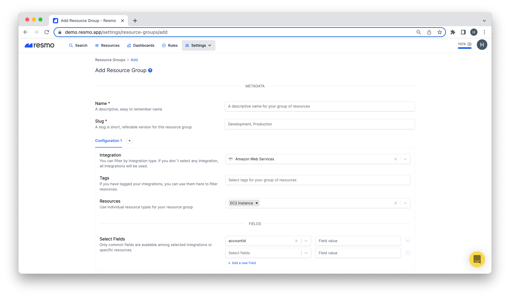

# Resource Groups

A Resource Group is a logical classification for a set of assets. The common use cases of resource groups are:

* Environments like development, staging, and production
* Accounts, especially in Cloud providers like AWS, Azure, GCP, etc.
* Integrations, Resource Types
* Tags on the integrations

Created resource groups can be used in:

* **Rules:** Each rule is evaluated for all resources and the resource groups you have.
* **Notifications:** You can send notifications to the resource groups you have.
* **Queries:** You can run queries against the resource groups you have.
* **Dashboards:** You can reuse the dashboards with the resource groups to make them even more useful!

### How to create a resource group

1. Login to your Resmo account and navigate to Settings>Resource Groups.

.png>)

2\. Then, click the Add Resource Group button.

3\. Name your resource group and type a slug. (A slug is a short, referable version for this resource group.)

4\. Next, you'll need to add a configuration (or optionally multiple.) Select an integration.

5\. Optionally, you can add tags for better filtering your resource groups.

6\. Select individual resource types for your resource group.

7\. Lastly, select fields and enter field value. Only common fields are available among selected integrations or specific resources.

8\. Hit the create button, and your resource group will be all set!

### Support

Still have questions about Resource Groups? Contact us via live chat on our website or email us at contact@resmo.com.
